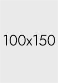

<!-- ===================== HEADER — Anime Neon Sakura ===================== -->

  ╔══════════════════ ✦ ✦ ✦ ══════════════════╗  
  <h1>🌸✨ Xte • Avin1731 ✨🌸</h1>  
  ╚══════════════════ ✦ ✦ ✦ ══════════════════╝  

  <h4>⚡🌸 Welcome to My GitHub 🌸⚡</h4>

  
  
╔══════════════════ ✦ ✦ ✦ ══════════════════╗

  <section>
    <h3 style="font-weight: bold; margin: 4px 0;">~ Electronics Engineering</h3>
    <h3 style="font-weight: bold; margin: 4px 0;">&</h3>
    <h3 style="font-weight: bold; margin: 4px 0;">Software Engineering ~</h3>
  </section>

  <h4 style="font-weight: normal;">Web Developer &rArr; Frontend Developer</h4>
  <h5 style="font-weight: normal;">~ Anime Enthusiast • Hololive Fans • Gaming Enjoyer ~</h5>
   
  
╚══════════════════ ✦ ✦ ✦ ══════════════════╝
  

  
╔══════════════════ ✦ ✦ ✦ ══════════════════╗
 

<!-- ===================== WHO AM I ===================== -->
<section>
  

    <h2>🌸✨ Who Am I? ✨🌸</h2>
    <i>"Maybe you know me, but you don't understand me.." ~ 1412</i>
  

  <ul>
    <li>💻 Frontend Web Developer</li>
    <li>🌸 Loves tidy workflows, tidy code, and of course… anime</li>
    <li>⚡ Tech interests: Laravel, Next.js, Typescript, APIs, Python</li>
    <li>🎧 Often codes with anisong and VTuber streams in the background</li>
    <li>⭐ Codes and works best when the world is asleep</li>
    <li>🌌 Sometimes I feel like a side character… until I write code</li>
  </ul>

  
╚══════════════════ ✦ ✦ ✦ ══════════════════╝

  
╔══════════════════ ✦ ✦ ✦ ══════════════════╗

</section>

<!-- ===================== TECH STACK ===================== -->
<section>
  

    <h2>⚡ Tech Stack ⚡</h2>
    
  

  
╚══════════════════ ✦ ✦ ✦ ══════════════════╝

  
╔══════════════════ ✦ ✦ ✦ ══════════════════╗

</section>

<!-- ===================== PROJECTS ===================== -->
<section>
  

    <h2>🌸 Featured Projects 🌸</h2>
  

    <table class="projects-table">
      <thead>
        <tr>
          <th width="150">Cover</th>
          <th width="400">Project Details</th>
          <th width="150">Status</th>
        </tr>
      </thead>
      <tbody>
        <!-- Baris 1: Completed -->
        <tr class="status-completed-row">
          <td>
            
          </td>
          <td class="project-details">
            
Coming Soon..

            
Coming Soon..

            

              React
              Node.js
              MongoDB
              Stripe
            

          </td>
          <td class="status-cell">
            Completed
          </td>
        </tr>
        <!-- Baris 2: In Progress -->
        <tr class="status-progress-row">
          <td>
            
          </td>
          <td class="project-details">
            
Coming Soon..

            
Coming Soon..

            

              React
              Node.js
              MongoDB
              Stripe
            

          </td>
          <td class="status-cell">
            On Progress
          </td>
        </tr>
        <!-- Baris 3: In Progress -->
        <tr class="status-progress-row">
          <td>
            
          </td>
          <td class="project-details">
            
Coming Soon..

            
Coming Soon..

            

              React
              Node.js
              MongoDB
              Stripe
            

          </td>
          <td class="status-cell">
            On Progress
          </td>
        </tr>
      </tbody>
    </table>
  

  

  
╚══════════════════ ✦ ✦ ✦ ══════════════════╝

  
╔══════════════════ ✦ ✦ ✦ ══════════════════╗

</section>

<section>
  

    <h2>🌸 My favorite Anime 🌸</h2>
  

    

      <a href="https://myanimelist.net/anime/11757/Sword_Art_Online" target="_blank" class="anime-item" title="Anime 1">
        
        
Sword Art Online

      </a>
      <a href="https://myanimelist.net/anime/4654/Toaru_Majutsu_no_Index" target="_blank" class="anime-item" title="Anime 2">
        
        
Toaru Series

      </a>
      <a href="https://myanimelist.net/anime/235/Detective_Conan" target="_blank" class="anime-item" title="Anime 3">
        
        
Detective Conan

      </a>
      <a href="https://myanimelist.net/anime/14741/Chuunibyou_demo_Koi_ga_Shitai" target="_blank" class="anime-item" title="Anime 4">
        
        
Chuunibyou

      </a>
      <a href="https://myanimelist.net/anime/32615/Youjo_Senki" target="_blank" class="anime-item" title="Anime 5">
        
        
Youjo Senki

      </a>
      <a href="https://myanimelist.net/anime/50739/Otonari_no_Tenshi-sama_ni_Itsunomanika_Dame_Ningen_ni_Sareteita_Ken?q=otonari&cat=anime" target="_blank" class="anime-item" title="Anime 6">
        
        
Otonari Tenshi

      </a>
    

</section>

<!-- ===================== SOCIAL ===================== -->
<section>
  
╚══════════════════ ✦ ✦ ✦ ══════════════════╝

  
╔══════════════════ ✦ ✦ ✦ ══════════════════╗

  
  

    <h2>🔗 Connect With Me 🔗</h2>
    
    &nbsp;
    
    &nbsp;
    
  

  
╚══════════════════ ✦ ✦ ✦ ══════════════════╝

</section>

<!-- ===================== QUOTE ===================== -->
<section>
  
╔══════════════════ ✦ ✦ ✦ ══════════════════╗

  

    <h2>🌙⚡ Night Owl Dev Manifest ⚡🌙</h2>
    <i>"May your silent progress outshine the noise, 
    and may every late-night commit sharpen you sharper than yesterday."</i>
  

    
╚══════════════════ ✦ ✦ ✦ ══════════════════╝

</section>